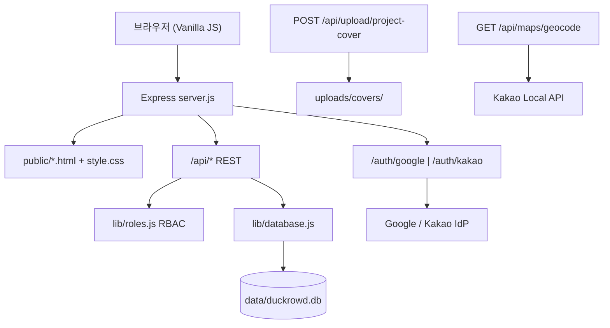
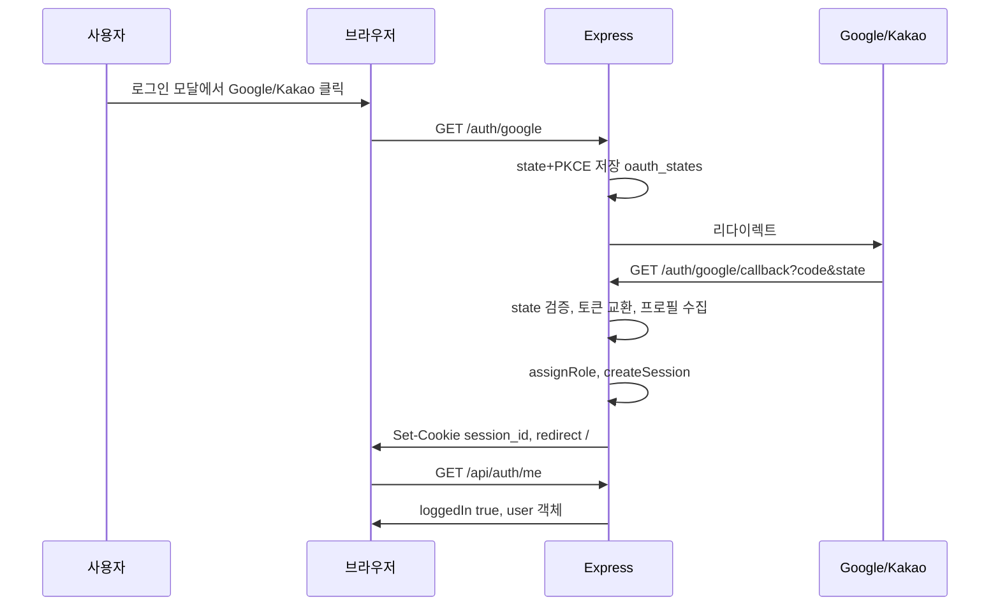
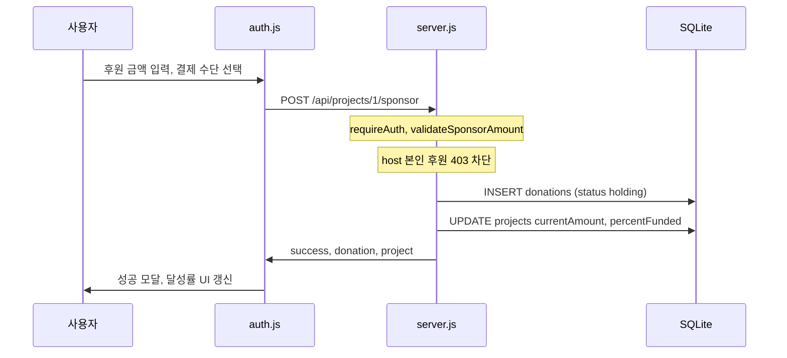
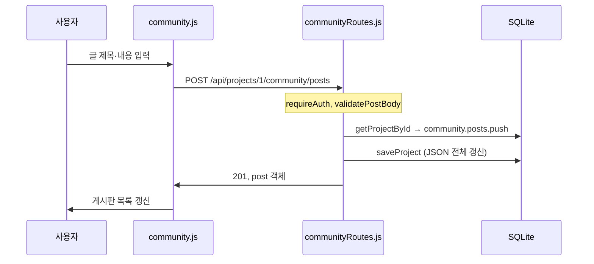

# Duckrowd — 교수님 Q&A 대비 (구현 방어 문서)

> **사업 기획서**: [`docs/planning/proposal.md`](docs/planning/proposal.md)  
> **본 문서 목적**: 발표 후 교수님 질의응답 대비 — 주요 구현사항의 동작 원리, 파일 위치, 라이브러리/API, 데이터 전달 경로 정리

---

## 0. 프로젝트 한 줄 소개

**Duckrowd(덕크라우드)**는 K-POP 팬 주최 이벤트 C2C 크라우드펀딩 **데모** 웹 애플리케이션입니다. Express 단일 서버가 정적 HTML·REST API를 제공하고, Google·Kakao **실제 OAuth** 로그인, 후원 결제(시뮬레이션), 프로젝트 등록, 커뮤니티 CRUD를 **SQLite**에 영속 저장합니다.

### 기술 스택

| 계층 | 기술 | 비고 |
|------|------|------|
| 런타임 | Node.js 18+ | `npm start` → `node server.js` |
| 서버 | Express 4.21 | API + 정적 HTML 동시 서빙 |
| DB | SQLite (`better-sqlite3`) | WAL 모드, `data/duckrowd.db` |
| 인증 | Google OIDC (`openid-client` + PKCE), Kakao OAuth 2.0 | Mock 없음, `.env` 필수 |
| 세션 | `HttpOnly` 쿠키 `session_id` + `cookie-parser` | 24시간, `sessions` 테이블 |
| 파일 업로드 | `multer` | `uploads/covers/` 디스크 저장 |
| 외부 API | Kakao Local API (지오코딩), Kakao Map JS SDK | `.env` REST/JS 키 |
| 프론트엔드 | 바닐라 HTML + JS | React/Vue/빌드 도구 없음 (MPA) |
| 스타일 | `public/style.css` | `:root` CSS 변수, `@media` 반응형 |

### 왜 React가 아닌가?

MVP 데모 범위에서 **OAuth·CRUD·권한 제어·SQLite 영속화** 검증을 우선했습니다. Express가 HTML과 API를 한 서버에서 처리하면 배포·시연·디버깅이 단순해지고, 평가 기준의 핵심 기능을 빠르게 구현할 수 있습니다. Phase 3에서 Flutter 전환을 기획 중입니다 (`README.md` To-Do).

---

## 1. 아키텍처 개요



### 요청 처리 공통 흐름

1. `express.json()` + `cookie-parser` 적용
2. `session_id` 쿠키 → `sessions` 테이블 조회 → `req.user` 주입 (`server.js` L51–64)
3. 라우트 핸들러 → `lib/validate.js` 검증 → `lib/roles.js` 권한 → `lib/database.js` → SQLite
4. 프로젝트·커뮤니티는 `projects.data` **JSON 컬럼**에 문서형 저장, 후원(`donations`)은 **정규화 테이블**

### 주요 디렉터리

```
.
├── server.js              # 앱 진입점, 페이지 라우팅, 핵심 API
├── lib/
│   ├── database.js        # SQLite 초기화·CRUD
│   ├── oauth.js           # Google/Kakao OAuth, 세션 생성
│   ├── roles.js           # RBAC (user/admin/host)
│   ├── validate.js        # 입력 검증, 페이지네이션
│   ├── projectList.js     # 검색·필터·정렬
│   ├── communityRoutes.js # 커뮤니티 CRUD API
│   ├── adminRoutes.js     # 관리자 심사·CSV
│   ├── favoritesRoutes.js # 즐겨찾기
│   ├── activity.js        # 활동 이력
│   ├── upload.js          # multer 이미지 업로드
│   ├── kakaoMap.js        # 카카오 지오코딩
│   └── csvExport.js       # CSV 생성
├── data/duckrowd.db       # 런타임 DB (자동 생성, .gitignore)
├── uploads/covers/        # 업로드 이미지 (자동 생성)
└── public/
    ├── index.html         # 메인
    ├── detail.html        # 프로젝트 상세
    ├── mypage.html        # 마이페이지
    ├── admin.html         # 관리자 콘솔
    ├── error.html         # 통합 에러 페이지
    ├── routes.js          # URL 생성·파싱
    ├── errors.js          # API 에러·토스트
    ├── auth.js            # 로그인·후원·등록 위저드
    ├── script.js          # 메인 목록·검색·페이지네이션
    ├── detail.js          # 상세·역할별 UI
    ├── community.js       # 커뮤니티 UI
    ├── mypage.js          # 마이페이지 탭
    ├── admin.js           # 관리자 UI
    ├── favorites.js       # 즐겨찾기
    ├── user-activity.js   # 검색·조회 이력
    └── style.css          # 전역 스타일·반응형
```

---

## 2. 평가 기준 28항목 대응표

| # | 기준 | 상태 | 핵심 파일/API |
|---|------|:----:|---------------|
| 1 | 3개 이상 주요 화면 | ✅ | `/`, `/projects/:id`, `/mypage`, `/admin` |
| 2 | 동적 라우팅 | ✅ | `server.js`, `public/routes.js` |
| 3 | 에러 코드·UX | ✅ | `error.html`, `errors.js`, API JSON 에러 |
| 4 | 권한 접근 제어 | ✅ | `lib/roles.js` |
| 5 | 반응형 UI | ✅ | `style.css` @media 1024/768/640px |
| 6 | 재시작 후 상태 유지 | ✅ | `data/duckrowd.db` |
| 7 | 목록→상세 연결 | ✅ | `script.js` → `DuckrowdRoutes.projectUrl()` |
| 8 | 데이터 생성 (폼) | ✅ | `auth.js` 위저드, `communityRoutes.js` |
| 9 | 수정·삭제 | ⚠️ | 커뮤니티 PATCH/DELETE ✅, 프로젝트 수정 API ❌ |
| 10 | 입력 유효성 검사 | ✅ | `lib/validate.js` |
| 11 | 키워드 검색 | ✅ | `GET /api/projects?q=` |
| 12 | 조건 필터 | ✅ | `filter`, `category`, `artist` |
| 13 | 정렬 | ✅ | `sort=newest\|popular\|closing` 등 |
| 14 | 페이지네이션 | ✅ | `limit`/`offset`/`hasMore` |
| 15 | 외부 API | ⚠️ | OAuth, Kakao Map/Geocode ✅, PG·GPS맵 ❌ |
| 16 | 활동 이력 | ✅ | `user_activity`, `user-activity.js` |
| 17 | 이미지 업로드 | ✅ | `multer` → `uploads/covers/` |
| 18 | 데이터보내기 | ⚠️ | CSV ✅, PDF ❌ |
| 19 | 로그인/로그아웃 | ✅ | 쿠키 세션, `/api/auth/*` |
| 20 | 소셜 OAuth | ✅ | Google PKCE + Kakao |
| 21 | 프로필/마이페이지 | ⚠️ | 5탭 마이페이지 ✅, 닉네임 변경 ❌ |
| 22 | 즐겨찾기 | ✅ | `user_favorites`, `favorites.js` |
| 23 | 로딩/에러 | ✅ | 스켈레톤, 스피너, `error.html` |
| 24 | 토스트/모달 | ✅ | `errors.js`, `auth.js` 모달 |
| 25 | 데이터 시각화 | ⚠️ | 달성률·trust-bar·투표 막대, Chart.js ❌ |
| 26 | 디자인 시스템 | ⚠️ | `:root` CSS 변수, docs HSL 명세와 갭 |
| 27 | 다크모드 | ❌ | 의도적 배제 |
| 28 | 다국어 i18n | ❌ | 한국어 고정, 의도적 배제 |

**충족 22 / 부분 6 / 미구현 2** (의도적 배제 2건 포함)

---

## 3. 레이어별 상세 Q&A

### 3.1 레이어 1 — 라우팅·레이아웃·상태 유지 (1~6)

---

#### 1. 3개 이상의 주요 화면 구성

**충족 여부**: ✅ 충족

**구현 위치**

| 화면 | URL | HTML | 목적 |
|------|-----|------|------|
| 메인 (프로젝트 목록) | `/` | `index.html` | 히어로, 검색·필터, 프로젝트 그리드 |
| 프로젝트 상세 | `/projects/:id` | `detail.html` | 스토리·커뮤니티·후원 패널 |
| 마이페이지 | `/mypage` | `mypage.html` | 후원·개설·커뮤니티·즐겨찾기·활동 |
| 관리자 콘솔 | `/admin` | `admin.html` | 심사 대기·승인/거절·DM |

추가: `error.html`(에러), `oauth-setup.html`(OAuth 미설정 안내), 모달형 로그인·후원·등록 위저드(`auth.js`)

**동작 원리**

각 HTML은 독립 MPA 페이지입니다. 페이지 전환 시 브라우저가 full navigation으로 새 HTML을 받고, 공통 헤더·`style.css`로 레이아웃을 통일합니다.

**예상 질문 & 답변**

- **Q: SPA가 아닌데 화면이 몇 개인가?**  
  A: 독립 HTML 6개 + 모달 3종(로그인, 후원, 프로젝트 등록)입니다. 평가 기준의 "독립적 목적을 가진 메인 화면"은 메인·상세·마이페이지·관리자 4개로 충족합니다.

- **Q: 헤더·네비는 어떻게 공유하나?**  
  A: 각 HTML에 동일한 `.site-header` 마크업을 두고, `auth.js`의 `checkLoginStatus()`가 `/api/auth/me`로 로그인 UI를 동기화합니다.

---

#### 2. 동적 라우팅 (`/post/:id` 형태)

**충족 여부**: ✅ 충족

**구현 위치**

- 서버: `server.js` L474–491
- 클라이언트: `public/routes.js`

**동작 원리**

Express가 URL 파라미터를 받아 동일 HTML을 서빙하고, JS가 pathname에서 ID를 파싱합니다.

```
GET /projects/3          → detail.html → parseProjectRoute() → { id: "3" }
GET /projects/3/posts/42 → detail.html → { id: "3", tab: "community", post: "42" }
GET /admin/projects/3    → admin.html  → parseAdminRoute() → { projectId: "3" }
```

레거시 URL `/detail.html?id=3`은 301 리다이렉트로 `/projects/3`으로 통일합니다.

**예상 질문 & 답변**

- **Q: React Router 없이 동적 라우팅을 어떻게 하나?**  
  A: **서버측** Express `app.get('/projects/:id')`가 `detail.html`을 보내고, **클라이언트측** `parseProjectRoute()`가 `window.location.pathname`에서 ID를 추출해 `GET /api/projects/:id`를 호출합니다. SPA 라우터 없이도 RESTful URL을 지원합니다.

- **Q: 게시글 상세 URL은?**  
  A: `/projects/:id/posts/:postId` 형태입니다. `DuckrowdRoutes.projectUrl(id, { post })`로 생성합니다.

---

#### 3. 상황에 맞는 에러 코드 및 UX

**충족 여부**: ✅ 충족

**구현 위치**

| 계층 | 파일 | 처리 |
|------|------|------|
| API | `server.js`, 각 라우트 | 400/401/403/404/500 JSON `{ error, code }` |
| 페이지 | `public/error.html` | `?code=401\|403\|404\|500` 분기 |
| 클라이언트 | `public/errors.js` | `handleApiResponse()` — 401→로그인 모달 |
| 상세 인라인 | `public/detail.js` | `renderNotFound()`, `renderServerError()` |
| Catch-all | `server.js` L605–621 | 미매칭 URL→404 redirect, 예외→500 redirect |

**동작 원리**

- API 요청 실패: `errors.js`가 상태코드별 토스트 표시. 401이면 `showLoginModal()` 자동 호출.
- 존재하지 않는 페이지 URL: Express catch-all이 `/error.html?code=404&from=...`로 리다이렉트.
- `error.html`은 `ERROR_CONTENT` 객체로 코드별 제목·설명·버튼(홈/로그인/재시도)을 분기합니다.

**예상 질문 & 답변**

- **Q: 401과 403의 차이는?**  
  A: **401** = 로그인 안 됨 (`requireAuth` 미통과). **403** = 로그인은 됐으나 권한 없음 (비관리자가 admin API 호출, 타인 프로젝트 수정 시도 등).

- **Q: API 에러와 페이지 에러를 어떻게 구분하나?**  
  A: `/api/*` 경로는 JSON 응답, 그 외 HTML 경로는 `error.html` 리다이렉트입니다. 프론트 JS는 fetch 후 `handleApiResponse()`로 JSON 에러를 토스트 처리합니다.

---

#### 4. 사용자 권한에 따른 접근 제어

**충족 여부**: ✅ 충족

**구현 위치**: `lib/roles.js`

**역할 체계**

| 역할 | 조건 | 권한 |
|------|------|------|
| `guest` | 미로그인 | 읽기 전용, 후원·글쓰기 불가 |
| `backer` | 로그인 일반 사용자 | 후원, 커뮤니티 글·댓글, 본인 후원 환불 |
| `host` | `project.hostUserId === user.id` | 해당 프로젝트 공지·일정·투표 등록 |
| `admin` | `.env` `ADMIN_IDENTIFIERS`/`ADMIN_EMAILS` 매칭 | 심사·삭제·DM·전체 후원 CSV |

**미들웨어**

- `requireAuth` — 401
- `requireAdmin` — 401 또는 403
- `requireHostOrAdmin(projectGetter)` — 총대 또는 관리자만 수정

**예상 질문 & 답변**

- **Q: 타인 데이터 수정을 어떻게 막나?**  
  A: 커뮤니티 PATCH/DELETE 시 `post.authorId === req.user.id` 또는 `requireHostOrAdmin`으로 검증합니다. 후원 환불은 `donation.userId === req.user.id`일 때만 허용합니다.

- **Q: 관리자는 어떻게 지정하나?**  
  A: OAuth 로그인 후 `roles.assignRole()`이 `.env`의 `ADMIN_IDENTIFIERS`(이메일 앞부분·이름·id) 또는 `ADMIN_EMAILS`와 매칭해 `role: 'admin'`을 부여합니다. 기본값 `dodamm111`.

- **Q: `/admin` URL은 누구나 열 수 있지 않나?**  
  A: HTML 자체는 누구나 받을 수 있으나, `admin.js`가 API 호출 시 403이면 "접근 권한 없음" UI를 표시하고, 모든 관리 API는 `requireAdmin`으로 서버에서 차단합니다.

---

#### 5. 반응형 UI

**충족 여부**: ✅ 충족

**구현 위치**: `public/style.css` — `@media (max-width: 1024px)`, `768px`, `640px`

**동작 원리**

- 1024px 이하: 프로젝트 그리드 3열→2열, 상세 2컬럼→1컬럼
- 640px 이하: 헤더 wrap, 검색 full-width, 그리드 1열
- 모든 HTML에 `<meta name="viewport" content="width=device-width, initial-scale=1.0">`

**예상 질문 & 답변**

- **Q: 어떤 CSS 프레임워크를 쓰나?**  
  A: Tailwind/Bootstrap 없이 **Vanilla CSS** + `:root` 변수 + Flexbox/Grid입니다. 데모 범위에서 의존성을 최소화했습니다.

---

#### 6. 서비스 재시작 후 이전 상태 유지

**충족 여부**: ✅ 충족

**구현 위치**: `lib/database.js`, `data/duckrowd.db`

**저장 대상**

| 데이터 | 저장소 | 테이블/위치 |
|--------|--------|-------------|
| 프로젝트·커뮤니티 | SQLite | `projects.data` (JSON) |
| 후원 | SQLite | `donations` |
| 로그인 세션 | SQLite | `sessions` |
| OAuth state | SQLite | `oauth_states` |
| 즐겨찾기 | SQLite | `user_favorites` |
| 활동 이력 | SQLite | `user_activity` |
| 검색 이력 (보조) | localStorage | `user-activity.js` |

**동작 원리**

`better-sqlite3` + WAL 모드. 서버 시작 시 `initDatabase()`가 DB 파일을 열고, 비어 있으면 시드 10건 삽입. CRUD는 즉시 디스크에 반영됩니다.

**예상 질문 & 답변**

- **Q: 메모리만 쓰면 재시작 시 데이터가 사라지지 않나?**  
  A: 아닙니다. 모든 CRUD 결과는 `data/duckrowd.db`에 영속화됩니다. DB 파일을 삭제하면 최초 실행 시 샘플 10개가 다시 시드됩니다.

- **Q: 왜 MongoDB가 아닌 SQLite인가?**  
  A: MVP 데모에서 단일 파일 DB로 배포·시연이 간단합니다. README To-Do에 MongoDB·정식 스키마 마이그레이션이 Phase 2로 명시되어 있습니다.

---

### 3.2 레이어 2 — CRUD·검색·API·미디어 (7~18)

---

#### 7. 목록 조회 + 상세 페이지 연결

**충족 여부**: ✅ 충족

**데이터 흐름**

```
index.html → script.js
  → GET /api/projects?filter=featured&limit=12&offset=0
  → 카드 렌더링
  → 카드 클릭 → DuckrowdRoutes.projectUrl(id) → /projects/3
  → detail.js → GET /api/projects/3 → 상세 렌더
```

**예상 질문 & 답변**

- **Q: 목록 API 응답 형식은?**  
  A: `{ success, projects[], count, limit, offset, hasMore, filter, sort }` 형태입니다. 카드용 필드는 `projectList.toListCard()`로 축약합니다.

---

#### 8. 데이터 생성 (폼 제출)

**충족 여부**: ✅ 충족

**주요 생성 플로우**

| 기능 | UI | API | 저장 |
|------|-----|-----|------|
| 프로젝트 등록 | `auth.js` 3단계 위저드 | `POST /api/projects` | `projects` 테이블 |
| 후원 | `auth.js` 체크아웃 모달 | `POST /api/projects/:id/sponsor` | `donations` + project 갱신 |
| 커뮤니티 글 | `community.js` | `POST /api/projects/:id/community/posts` | project JSON 내 `posts[]` |
| 공지·일정·투표 | `community.js` | 각 POST 엔드포인트 | project JSON 내 해당 배열 |

**예상 질문 & 답변**

- **Q: 프로젝트 등록 폼 데이터는 어떻게 전달되나?**  
  A: 위저드 3단계에서 `title, category, goalAmount, story, daysLeft, escrowPlan, coverImage`를 모아 `fetch('POST /api/projects', { body: JSON })`로 전송합니다. 서버 `validateProjectCreate()`가 검증 후 `db.createProject()`로 저장합니다.

- **Q: 등록 직후 메인에 안 보이는 이유는?**  
  A: 신규 프로젝트는 `status: '심사 중'`, `featured: false`로 생성됩니다. 관리자 승인 전까지 메인 추천 목록에 노출되지 않고, 마이페이지 「개설 신청 프로젝트」탭에서만 확인 가능합니다.

---

#### 9. 데이터 수정 또는 삭제

**충족 여부**: ⚠️ 부분 충족

**구현됨**

- 커뮤니티 게시글: `PATCH /api/projects/:id/community/posts/:postId` (본인만)
- 커뮤니티 댓글: `PATCH /api/projects/:id/community/comments/:commentId` (본인만)
- 공지·일정·투표·게시글·댓글: `DELETE` (총대·관리자 또는 본인)
- 후원 환불: `POST /api/donations/:id/refund` (본인, `holding` 상태만)
- 관리자 프로젝트 삭제: `DELETE /api/admin/projects/:id`

**미구현**

- 프로젝트 본문(제목·스토리·목표금) 수정 API (`PUT/PATCH /api/projects/:id`) 없음

**예상 질문 & 답변**

- **Q: 내 글만 수정할 수 있나?**  
  A: 네. `communityRoutes.js`에서 `post.authorId !== req.user.id`이면 403을 반환합니다. 공지·일정은 `requireHostOrAdmin`으로 총대·관리자만 등록·삭제합니다.

---

#### 10. 사용자 입력 유효성 검사

**충족 여부**: ✅ 충족

**구현 위치**: `lib/validate.js`

| 검증 항목 | 규칙 |
|-----------|------|
| 프로젝트 제목 | 필수, 200자 이하 |
| 카테고리 | 9개 화이트리스트 (`생일카페`, `지하철광고` 등) |
| 목표 금액 | 10,000원 이상 정수 |
| 후원 금액 | 1,000원 이상 정수 |
| 스토리 | 필수, 10,000자 이하 |
| 펀딩 기간 | 1~90일 |
| 게시글·댓글 | 필수, 길이 제한 |
| 페이지네이션 | `limit` 1~50, `offset` ≥ 0 |

실패 시 `400` + `{ error, code: 'VALIDATION_ERROR' }` 반환.

**예상 질문 & 답변**

- **Q: 프론트에서도 검증하나?**  
  A: 위저드·모달에서 HTML `required`, `min` 속성과 JS 사전 검증이 있고, **최종 검증은 서버** `validate.js`에서 수행합니다. 클라이언트 검증만으로는 우회 가능하므로 서버 검증이 필수입니다.

---

#### 11. 키워드 검색

**충족 여부**: ✅ 충족

**구현 위치**: `lib/projectList.js` — `listProjects()` 내 `q` 파라미터

**검색 대상 필드**: `title`, `hostName`, `category`, `artist`, `story`(HTML 태그 제거 후)

**데이터 흐름**

```
헤더 검색창 (script.js)
  → GET /api/projects?q=지민&filter=all
  → projectList.listProjects() 인메모리 필터
  → 결과 그리드 갱신
```

검색 시 `filter=featured`이면 자동으로 `filter=all`로 전환해 전체에서 검색합니다.

---

#### 12. 조건 기반 필터링

**충족 여부**: ✅ 충족

**필터 옵션** (`GET /api/projects`)

| 파라미터 | 값 예시 | 의미 |
|----------|---------|------|
| `filter` | `featured`, `ongoing`, `popular`, `new`, `upcoming`, `closing`, `all` | 상태·추천 기준 |
| `category` | `생일카페`, `지하철광고` 등 | 카테고리 |
| `artist` | 아티스트명 | 아티스트별 |

메인 `.site-nav` 숏컷 버튼이 `filter`/`category` 쿼리를 변경합니다.

---

#### 13. 기준 선택 정렬

**충족 여부**: ✅ 충족

**정렬 옵션** (`lib/validate.js` `SORT_OPTIONS`)

| `sort` 값 | 기준 |
|-----------|------|
| `newest` | 제출일 최신순 |
| `oldest` | 제출일 오래된순 |
| `title_asc` / `title_desc` | 제목 가나다순 |
| `popular` | 인기순 (`popularRank` 또는 달성률) |
| `closing` | 마감 임박순 (`daysLeft`) |

---

#### 14. 페이지네이션

**충족 여부**: ✅ 충족

**구현**: `limit`(기본 12, 최대 50) + `offset` + `hasMore` 플래그

```
GET /api/projects?limit=12&offset=0   → 첫 페이지
GET /api/projects?limit=12&offset=12  → 다음 페이지
```

`script.js`가 「더 보기」버튼 또는 offset 증가로 다음 묶음을 로드합니다. 무한 스크롤 대신 **offset 기반 페이지네이션**을 사용합니다.

---

#### 15. 외부 API 활용

**충족 여부**: ⚠️ 부분 충족

**구현됨**

| API | 라이브러리/서비스 | 용도 | 파일 |
|-----|------------------|------|------|
| Google OAuth | `openid-client` + PKCE | 로그인 | `lib/oauth.js` |
| Kakao OAuth | fetch (authorization code) | 로그인 | `lib/oauth.js` |
| Kakao Local API | REST (`KAKAO_REST_API_KEY`) | 주소→좌표 지오코딩 | `lib/kakaoMap.js` |
| Kakao Map JS SDK | CDN 동적 로드 | 일정 위치 지도 표시 | `public/maps.js` |

**미구현** (명세만 존재)

- `GET /api/projects/map` — GPS 기반 주변 행사 (`docs/api/api_spec.md` To-Be)
- PG 결제 (토스/카카오페이 등)
- `POST /api/tickets/verify` — QR 입장 검증

**예상 질문 & 답변**

- **Q: 카카오 지도는 어떻게 연동했나?**  
  A: 일정 등록 시 서버가 `kakaoMap.geocodeAddress()`로 Kakao Local API를 호출해 `lat/lng`를 저장하고, 상세 페이지 `maps.js`가 `GET /api/config/public`로 JS 키를 받아 Kakao Map SDK를 로드합니다.

- **Q: OAuth 보안은?**  
  A: Google은 **PKCE(S256)** + `state` 검증, Kakao도 `state` 검증합니다. `oauth_states` 테이블에 10분 TTL로 저장 후 1회 소비(consume)합니다.

---

#### 16. 사용자 활동 이력 관리

**충족 여부**: ✅ 충족

**구현**

| 계층 | 파일 | 내용 |
|------|------|------|
| DB | `lib/activity.js` | `user_activity` 테이블, 타입별 최대 20건 |
| API | `lib/activityRoutes.js` | `GET/POST /api/users/me/activity` |
| 자동 기록 | `server.js` | 프로젝트 상세 조회 시 `type: 'view'` |
| 클라이언트 | `public/user-activity.js` | 검색 시 `type: 'search'` 기록 + localStorage 보조 |
| 표시 | `mypage.js` | 「최근 활동」탭 |

**예상 질문 & 답변**

- **Q: 최근 검색어는 어디에 저장되나?**  
  A: 로그인 사용자는 서버 `user_activity` 테이블에, 비로그인은 `localStorage`에 보조 저장합니다. 마이페이지에서 서버 이력을 우선 표시합니다.

---

#### 17. 이미지 업로드 / 미리보기

**충족 여부**: ✅ 충족

**구현 위치**: `lib/upload.js`, `server.js` `POST /api/upload/project-cover`

**동작 원리**

1. 등록 위저드에서 `<input type="file">` 선택
2. `auth.js`가 `FormData`로 `POST /api/upload/project-cover` 전송 (로그인 필수)
3. `multer`가 `uploads/covers/cover-{timestamp}-{random}.jpg`로 디스크 저장
4. 응답 URL(`/uploads/covers/...`)을 위저드 미리보기 + `POST /api/projects`의 `coverImage`에 포함
5. `express.static('/uploads')`로 브라우저 접근

**제한**: JPEG/PNG/WebP/GIF, 최대 2MB

**예상 질문 & 답변**

- **Q: 이미지는 DB에 저장하나?**  
  A: 아닙니다. **서버 디스크** `uploads/covers/`에 저장하고, DB에는 URL 문자열만 저장합니다.

---

#### 18. 데이터보내기 (CSV/PDF)

**충족 여부**: ⚠️ 부분 충족 (CSV만)

**구현됨**

| 대상 | URL | 파일 |
|------|-----|------|
| 내 후원 내역 | `GET /api/users/me/escrow/export.csv` | `server.js`, `lib/csvExport.js` |
| 관리자 전체 후원 | `GET /api/admin/export/donations.csv` | `lib/adminRoutes.js` |

`csvExport.js`가 `text/csv; charset=utf-8` 헤더와 BOM 없는 UTF-8 CSV를 생성합니다. 마이페이지에 `<a download>` 링크가 있습니다.

**미구현**: PDF보내기

**예상 질문 & 답변**

- **Q: PDF는 왜 없나?**  
  A: MVP에서 조회 결과보내기 요구는 CSV로 충족했습니다. PDF는 Phase 2에서 검토 예정입니다.

---

### 3.3 레이어 3 — 인증·UX·시각화 (19~28)

---

#### 19. 로그인 / 로그아웃

**충족 여부**: ✅ 충족

**동작 원리**

- 로그인: OAuth 콜백 후 `oauth.createSession()`이 `session_id` HttpOnly 쿠키 발급 → `sessions` 테이블에 프로필 JSON 저장
- 상태 확인: `GET /api/auth/me` → `{ loggedIn, user }`
- 로그아웃: `POST /api/auth/logout` → 세션 삭제 + 쿠키 `Max-Age=0`

이메일·비밀번호 로그인은 **의도적 배제** (OAuth 전략과 일관성).

---

#### 20. 소셜 로그인 (OAuth)

**충족 여부**: ✅ 충족

**플로우**



`.env` 미설정 시 `oauth-setup.html`로 안내합니다. **Mock 로그인 없음**.

---

#### 21. 사용자 프로필 / 마이페이지

**충족 여부**: ⚠️ 부분 충족

**마이페이지 5탭** (`/mypage?tab=...`)

| 탭 | 내용 | API |
|----|------|-----|
| `donations` | 내 후원·환불 내역 | `GET /api/users/me/escrow` |
| `hosted` | 내가 개설한 프로젝트 | 동일 |
| `community` | 내 글·댓글 | `GET /api/users/me/community` |
| `favorites` | 관심 프로젝트 | `GET /api/users/me/favorites` |
| `history` | 최근 검색·조회 | `GET /api/users/me/activity` |

프로필 표시: OAuth IdP에서 받은 `name`, `email`, `avatar` (헤더 드롭다운)

**미구현**: 닉네임 변경 API — IdP 표시명으로 충분하다고 README에서 명시

---

#### 22. 즐겨찾기 / 북마크

**충족 여부**: ✅ 충족

**데이터 흐름**

```
카드/상세 ♡ 클릭 (favorites.js FavoriteStore)
  → POST /api/users/me/favorites/:projectId  (추가)
  → DELETE /api/users/me/favorites/:projectId (제거)
  → user_favorites 테이블 (user_id, project_id)
  → 마이페이지 favorites 탭에서 목록 표시
```

비로그인 시 경고 토스트 + 로그인 모달 유도.

---

#### 23. 로딩 / 에러 상태 처리

**충족 여부**: ✅ 충족

| 패턴 | 위치 | 용도 |
|------|------|------|
| 스켈레톤 카드 | `script.js` `renderProjectSkeletons()` | 메인 목록 로딩 |
| 텍스트 placeholder | 각 HTML 초기 상태 | 첫 페인트 |
| 스피너 오버레이 | `auth.js`, `mypage.js` `.escrow-spinner` | 후원·등록·탭 로딩 |
| 에러 페이지 | `error.html` | 401/403/404/500 |
| API 에러 토스트 | `errors.js` | fetch 실패 |

---

#### 24. 의미 있는 피드백 (토스트·모달)

**충족 여부**: ✅ 충족

| 피드백 | 구현 |
|--------|------|
| 후원 완료 | 체크아웃 모달 성공 애니메이션 |
| 환불 확인 | `confirm()` 대화상자 |
| 즐겨찾기 | success/info 토스트 |
| API 401 | warning 토스트 + 로그인 모달 |
| 프로젝트 등록 완료 | 위저드 완료 단계 + 토스트 |

`showToast(message, type, duration)` — `error|warning|success|info`, `aria-live="polite"`

---

#### 25. 데이터 시각화

**충족 여부**: ⚠️ 부분 충족

**구현된 시각화** (Chart.js 없음)

| 시각화 | 방식 | 위치 |
|--------|------|------|
| 펀딩 달성률 | 숫자 % + 진행 표시 | 카드, 상세 summary |
| 덕질 온도 | `.trust-bar` width % | `script.js`, `detail.js` |
| 투표 결과 | `.poll-result-fill` 가로 막대 | `community.js` |
| 마이페이지 통계 | `stat-card` 3종 | `mypage.js` |
| 관리자 통계 | `admin-stat` 숫자 카드 | `admin.js` |

Chart.js 대시보드는 README에서 **의도적 배제** — CSS 바·숫자 카드로 MVP 요구를 충족한다고 정당화합니다.

---

#### 26. 디자인 시스템 활용

**충족 여부**: ⚠️ 부분 충족

**실제 구현** (`style.css` `:root`)

```css
--color-primary: #00c471;
--color-text, --color-bg, --color-surface
--shadow-sm/md, --radius-sm/md/full
--header-height, --max-width: 1200px
```

공통 컴포넌트: `.btn`, `.project-card`, `.modal-overlay`, `.badge-*`, `.toast`, `.skeleton`

**갭**: `docs/design/design_system.md`의 HSL·glassmorphism·다크 테마는 **문서 명세만** 존재하고 런타임 CSS에는 미반영. README: "`:root` CSS 변수 수준 유지".

---

#### 27. 다크모드 지원

**충족 여부**: ❌ 미구현 (의도적 배제)

README: "데모·브랜드 일관성". `prefers-color-scheme`·테마 토글 없음.

---

#### 28. 다국어 (i18n) 지원

**충족 여부**: ❌ 미구현 (의도적 배제)

모든 HTML `lang="ko"`, UI 문자열 하드코딩. `toLocaleString('ko-KR')` 포맷만 사용. README: "한국어 단일 시장 대상".

---

## 4. 핵심 기능 데이터 흐름

### 4.1 후원 결제 (시뮬레이션)



- 실제 PG 연동 없음. `paymentMethod`는 UI 선택값만 DB에 기록.
- 후원 상태: `holding` (에스크로 보관), `refunded`, `released`(UI만, 전환 API 미구현)

### 4.2 커뮤니티 게시글 작성



커뮤니티 데이터는 별도 테이블 없이 `projects.data` JSON 안에 `notices`, `schedules`, `polls`, `posts` 배열로 저장됩니다.

### 4.3 환불 시 모금액 롤백

```
POST /api/donations/:id/refund
  → donation.userId === req.user.id 확인
  → donation.status === 'holding' 확인
  → donation.status = 'refunded'
  → project.currentAmount -= donation.amount
  → project.percentFunded 재계산
  → saveProject
```

---

## 5. 예상 질문 TOP 20 + 모범 답변

### 아키텍처·기술 선택

**Q1. 왜 프론트엔드를 React가 아닌 바닐라 JS로 했나?**  
MVP 데모에서 OAuth·CRUD·권한·영속화 검증이 우선이었고, Express 단일 서버로 HTML+API를 함께 서빙하면 시연·디버깅이 단순합니다. Phase 3에서 Flutter 전환을 계획 중입니다.

**Q2. SQLite에 프로젝트 전체를 JSON으로 넣는 이유는?**  
데모 단계에서 스키마 변경 없이 커뮤니티(공지·일정·투표·게시글)를 빠르게 붙이기 위함입니다. 후원(`donations`)처럼 트랜잭션이 중요한 데이터만 정규화 테이블을 씁니다. 프로덕션에서는 `docs/database/db_schema.md`의 정규화 스키마로 마이그레이션 예정입니다.

**Q3. 세션 쿠키와 JWT 중 왜 세션을 선택했나?**  
`HttpOnly` 쿠키는 JS에서 접근 불가해 XSS로 토큰 탈취 위험을 줄입니다. 서버 `sessions` 테이블에서 즉시 무효화(로그아웃)가 가능합니다. JWT는 추후 모바일 앱 연동 시 고려할 수 있습니다.

**Q4. 서버 재시작 후 로그인이 유지되나?**  
네. `session_id` 쿠키와 `sessions` 테이블이 SQLite에 저장되므로, 서버를 재시작해도 쿠키가 유효한 한 로그인 상태가 유지됩니다.

### 인증·권한

**Q5. 관리자 권한은 어떻게 부여하나?**  
`.env`의 `ADMIN_IDENTIFIERS`(기본 `dodamm111`) 또는 `ADMIN_EMAILS`와 OAuth 프로필(이메일·이름·id)을 매칭합니다. `roles.assignRole()`이 `role: 'admin'`을 부여합니다.

**Q6. 총대(host)와 일반 후원자(backer) 화면 차이는?**  
`roles.getViewerRole()`이 `host`/`admin`/`backer`/`guest`를 판별하고, `detail.js`가 역할별 배너·버튼(공지 등록, 심사 정보 등)을 분기합니다.

**Q7. 본인 프로젝트에 후원할 수 있나?**  
아닙니다. `POST /api/projects/:id/sponsor`에서 `roles.isProjectHost()`이면 403을 반환합니다.

### 데이터·API

**Q8. 후원 데이터는 어디에 저장되나?**  
`donations` 테이블 — `id`, `user_id`, `project_id`, `amount`, `payment_method`, `status`, `created_at`. 프로젝트 모금액은 `projects.data` JSON의 `currentAmount`와 함께 갱신됩니다.

**Q9. 검색·필터 요청은 어떻게 서버에 전달되나?**  
`fetch('/api/projects?q=키워드&filter=ongoing&category=생일카페&sort=popular&limit=12&offset=0')`. Express가 query string을 파싱해 `projectList.listProjects()`에 전달합니다.

**Q10. 커뮤니티 글 수정 시 타인 글을 막는 방법은?**  
`PATCH` 핸들러에서 `post.authorId !== req.user.id`이고 관리자도 아니면 403. 총대 전용 기능(공지)은 `requireHostOrAdmin` 미들웨어를 사용합니다.

### 외부 연동·파일

**Q11. 업로드한 이미지 URL은 어떻게 구성되나?**  
`/uploads/covers/cover-1718000000000-abc123.jpg` — `express.static('/uploads')`로 서빙. DB `coverImage` 필드에 이 경로가 저장됩니다.

**Q12. 카카오 지도 API 키는 어디서 관리하나?**  
`.env`의 `KAKAO_REST_API_KEY`(지오코딩), `KAKAO_MAP_JAVASCRIPT_KEY`(지도 JS). `GET /api/config/public`이 JS 키만 클라이언트에 노출합니다.

**Q13. OAuth redirect URI는 왜 중요한가?**  
Google/Kakao 개발자 콘솔에 등록한 URI와 `.env` `REDIRECT_URI_BASE`가 **완전히 일치**해야 합니다. 불일치 시 OAuth 콜백이 실패합니다.

### 결제·비즈니스 로직

**Q14. 결제가 실제로 이루어지나?**  
아닙니다. **시뮬레이션**입니다. 결제 수단 UI만 있고 PG API 호출 없이 `donations` 레코드만 생성합니다. README에 명시되어 있습니다.

**Q15. `holding`과 `released` 상태 차이는?**  
`holding` = 에스크로 보관(환불 가능). `released` = 정산 완료(UI·배지에 표시되나, `holding→released` 전환 API는 아직 미구현).

**Q16. 프로젝트 등록 후 심사 흐름은?**  
`POST /api/projects` → `status: '심사 중'` → 관리자 `admin.html`에서 `POST /api/admin/projects/:id/review` (승인/거절) → 승인 시 `펀딩 진행 중`, 거절 시 DM + `심사 거절`.

### UX·평가 기준

**Q17. 404 페이지는 언제 보이나?**  
존재하지 않는 URL 접근 시 Express catch-all이 `/error.html?code=404`로 리다이렉트. API는 JSON 404. 상세에서 없는 프로젝트 ID면 `detail.js`가 인라인 404 UI를 표시합니다.

**Q18. 로딩 중 사용자 경험은?**  
메인 목록: 스켈레톤 카드. 후원·등록: 모달 내 스피너. 마이페이지 탭: `.escrow-spinner`. API 완료 전 빈 화면 대신 피드백을 제공합니다.

**Q19. 다크모드·i18n은 왜 없나?**  
README 「UX·인증 선별 적용 — 배제 항목」에 의도적으로 명시. 한국어 단일 시장 데모·브랜드 일관성 우선. 평가 기준 27·28은 스코프 밖으로 문서화했습니다.

**Q20. Chart.js 없이 시각화 기준을 충족한다고 볼 수 있나?**  
달성률 %, 덕질 온도 바, 투표 결과 막대, 마이페이지·관리자 숫자 카드로 **수치 데이터를 시각적으로 표현**합니다. 차트 라이브러리는 Phase 2 대시보드 확장 시 도입 예정입니다.

---

## 6. 의도적 미구현 및 Gap

### 6.1 의도적 배제 (README 명시)

| 항목 | 배제 이유 | 해당 평가 # |
|------|-----------|------------|
| 이메일·비밀번호 로그인 | Google·Kakao OAuth 전략 | 19 |
| 닉네임 변경 API | IdP 표시명으로 충분 | 21 |
| Chart.js / 그래프 대시보드 | CSS 바·숫자 카드로 충분 | 25 |
| 다크모드 | 데모·브랜드 일관성 | 27 |
| 다국어 i18n | 한국어 단일 시장 | 28 |

### 6.2 솔직히 인정할 Gap (방어가 아닌 한계)

| Gap | 현재 상태 | 향후 계획 |
|-----|-----------|-----------|
| 프로젝트 수정 API | 없음 | README To-Do |
| PG 실결제 | UI만 | 토스/카카오페이 연동 예정 |
| `holding→released` 정산 | UI만 | Phase 2 정산 엔진 |
| PDF보내기 | 없음 | CSV로 대체 |
| GPS 주변 행사 맵 | API 명세만 | Phase 3 |
| QR 입장 검증 | API 명세만 | Phase 3 |
| 신규 등록 프로젝트 메인 노출 | 마이페이지만 | 심사 승인 후 featured 로직 예정 |
| 덕질 온도 동적 계산 | UI 표시만 | 후원·성공·리뷰 기반 로직 예정 |

---

## 7. 데모 시연 체크리스트

### 사전 준비

- [ ] Node.js 18+ 설치 (`node -v`)
- [ ] `npm install` 완료
- [ ] `.env` 설정 (`.env.example` 복사)
  - [ ] `REDIRECT_URI_BASE=http://localhost:3000`
  - [ ] `GOOGLE_CLIENT_ID` / `GOOGLE_CLIENT_SECRET`
  - [ ] `KAKAO_CLIENT_ID`
  - [ ] (선택) `KAKAO_REST_API_KEY`, `KAKAO_MAP_JAVASCRIPT_KEY`
  - [ ] (선택) `ADMIN_IDENTIFIERS=dodamm111`
- [ ] `npm start` → `Duckrowd demo server running at http://localhost:3000` 확인
- [ ] `file://`가 아닌 `http://localhost:3000`으로 접속

### 권장 시연 순서 (약 10분)

1. **메인** — 히어로, 카테고리 필터, 검색 (`q=지민`)
2. **정렬·페이지네이션** — sort 변경, 더 보기
3. **상세** — 카드 클릭 → `/projects/1`, 달성률·덕질 온도·커뮤니티 탭
4. **OAuth 로그인** — Google 또는 Kakao
5. **후원** — 체크아웃 모달 → 금액 입력 → 달성률 갱신 확인
6. **즐겨찾기** — ♡ 토글 → 마이페이지 favorites 탭
7. **마이페이지** — 후원 내역, CSV 다운로드 링크
8. **환불** — holding 후원 취소 → 모금액 롤백 확인
9. **프로젝트 등록** — 3단계 위저드, 커버 이미지 업로드
10. **커뮤니티 CRUD** — 글 작성·수정·삭제, 투표 참여
11. **관리자** — `/admin` (admin 계정), 심사 승인/거절
12. **에러 UX** — 존재하지 않는 URL → 404 페이지
13. **영속성** — 서버 재시작(`Ctrl+C` → `npm start`) 후 후원·글 유지 확인

### 자주 실패하는 경우

| 증상 | 원인 | 해결 |
|------|------|------|
| OAuth 실패 | redirect URI 불일치 | 콘솔 URI = `{REDIRECT_URI_BASE}/auth/*/callback` |
| 목록 비어 있음 | 서버 미실행 또는 file:// 접속 | `npm start` + localhost 접속 |
| 지도 안 뜸 | Kakao 키 미설정 | `.env`에 REST/JS 키 추가 |
| 관리자 메뉴 안 보임 | admin 식별자 불일치 | `ADMIN_IDENTIFIERS`에 본인 OAuth 이메일 앞부분 추가 |

---

## 부록: 주요 API 빠른 참조

| 메서드 | 경로 | 인증 | 설명 |
|--------|------|:----:|------|
| GET | `/api/projects` | - | 목록 (검색·필터·정렬·페이지네이션) |
| GET | `/api/projects/:id` | - | 상세 (+ view 활동 기록) |
| POST | `/api/projects` | O | 프로젝트 등록 |
| POST | `/api/projects/:id/sponsor` | O | 후원 |
| POST | `/api/donations/:id/refund` | O | 환불 |
| GET | `/api/auth/me` | - | 로그인 상태 |
| POST | `/api/auth/logout` | - | 로그아웃 |
| GET | `/api/users/me/escrow` | O | 마이페이지 내역 |
| GET | `/api/users/me/escrow/export.csv` | O | 후원 CSV |
| GET/POST/DELETE | `/api/users/me/favorites/:id` | O | 즐겨찾기 |
| GET/POST | `/api/users/me/activity` | O | 활동 이력 |
| POST | `/api/upload/project-cover` | O | 커버 이미지 |
| GET | `/api/maps/geocode` | - | 주소 지오코딩 |
| GET/POST/DELETE | `/api/projects/:id/community/*` | 부분 | 커뮤니티 CRUD |
| GET/POST/DELETE | `/api/admin/*` | Admin | 심사·DM·CSV |

상세 API 목록: [`README.md`](README.md), [`docs/api/api_spec.md`](docs/api/api_spec.md)

---

*최종 업데이트: 프로젝트 데모 기준 (Express + SQLite + Vanilla JS MPA)*
