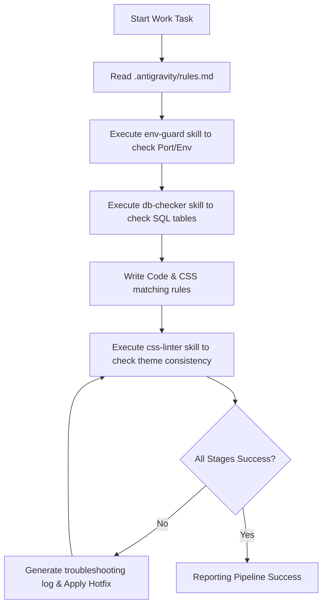

# Agent Automated Development Workflows

이 문서는 Antigravity 에이전트가 Duckrowd 코드를 빌드하고 기능 구현 명령을 받았을 때 스스로 태스크를 조율하며 수행하는 실제 에이전트 자율 워크플로우 명세서입니다.

실제 워크플로우 스펙 매니페스트는 프로젝트 루트의 [.antigravity/workflows/dev-pipeline.json](file:///c:/Workspace/KpopFandom_CrowdFunding/.antigravity/workflows/dev-pipeline.json)에 정의되어 있습니다.

---

## ⚙️ Workflow Execution Pipeline (자율 실행 파이프라인)

### 1. 환경 및 포트 검사 (env-guard)
- 에이전트가 개발 서버를 구동하기 전 포트 3000번 점유 여부와 소셜 로그인 변수(`.env`) 무결성을 사전에 체크합니다.

### 2. 데이터베이스 스키마 및 WAL 정합성 검사 (db-checker)
- SQLite DB 파일이 잠기지 않도록 WAL 모드 활성화 상태를 보장하고, 서비스 구동에 필요한 테이블들이 생성되었는지 검사합니다.

### 3. 코딩 규칙 적용 및 스타일 검사 (css-linter)
- 코드 작업 완료 후 `css-linter` 스킬을 사용하여 CSS 파일에 직접 Hex 컬러나 RGB 컬러 코드가 강제로 삽입되었는지 스캔하여 경고 리포트를 수집합니다.
