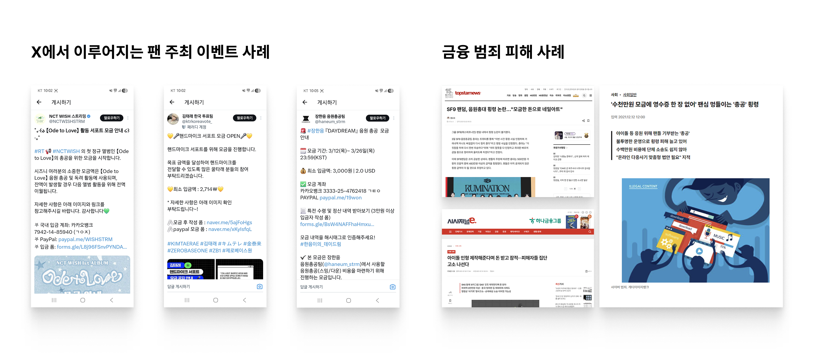
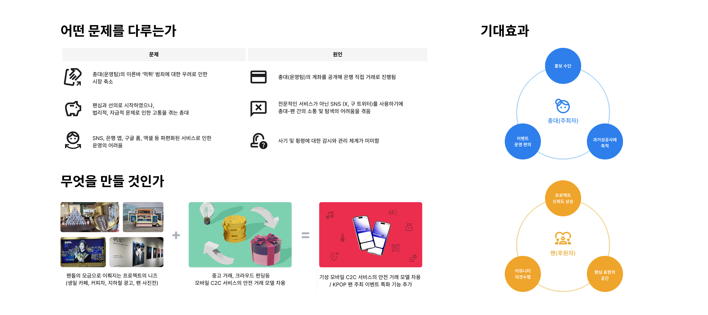
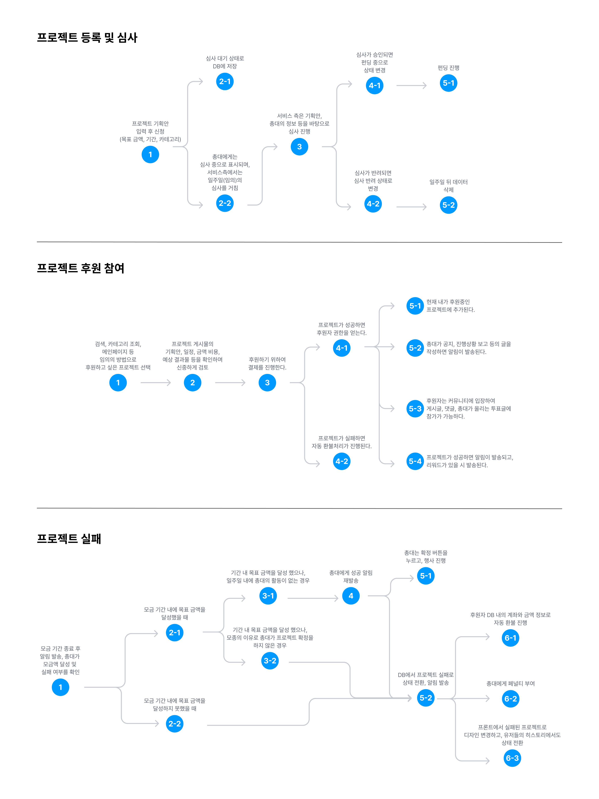
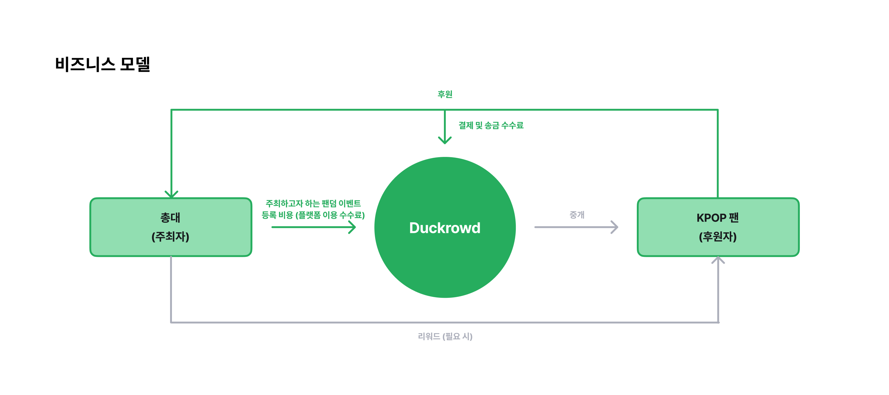

# 모두의 창업

Date: 2026년 5월 1일 → 2026년 5월 15일
Status: Done
URL: https://www.modoo.or.kr/

### **Q1. 나의 아이디어를 한 줄로 소개해주세요. (100자)**

K-POP 팬 주최 이벤트 펀딩 서비스를 통해, 현재 SNS 기반 소통을 넘어선 건강한 팬심 표현의 장 마련

### **Q2. 아이디어를 떠올린 배경 이야기를 들려주세요. (1000자)**

**[배경]**

현재 케이팝 팬덤 문화는 단순한 음반·굿즈 소비를 넘어, 팬들이 직접 광고를 게시하거나 생일 카페, 전시회 등의 이벤트를 기획·운영하는 ‘팬덤 주도형 프로젝트’가 자리잡고 있습니다. 하지만 이러한 팬덤 행사들은 개인 운영진(총대) 중심으로 자금을 모으고 관리하는 구조이다 보니, 사기 및 횡령 논란로 이어지는 사회적 문제가 발생하고 있습니다.

음원 총공이나 지하철 광고 등 대규모의 행사들은 보통 X(구 트위터)나 덕질 커뮤니티에서 이른바 ‘총대’라고 불리는 개인 운영진이 **자신의 계좌를 공개해 모금을 진행하는 방식**으로 운영되어 왔습니다. 그러나 이러한 은행 직접 거래는 별도의 검증·관리 체계 없이 개인 간의 신뢰에 의존해 자금이 운영된다는 한계를 가지고 있습니다. 이로 인해 모금액 횡령, 사기 등의 문제가 발생하기도 하며, 실제로 **수천만 원 규모의 피해 사례**도 지속적으로 나타나고 있습니다. 이는 팬덤 내 신뢰 저하와 운영 피로도 증가로 이어지며, 팬덤 문화의 지속 가능성을 위협하는 요소로 작용하고 있습니다.

**[달성 목표]**

저희 팀은 팬덤 프로젝트가 개인의 선의와 신뢰만으로 운영되고 있다는 구조적 문제에서 아이디어를 얻었습니다. 당근마켓이 이웃 간 중고 거래에 신뢰를 더하고, 텀블벅이 창작자의 꿈을 시스템으로 보호하듯, 팬덤 활동에도 **보호막이 되어 줄 플랫폼**이 필요하다고 느꼈습니다. 단순히 돈을 모으는 도구를 넘어, 팬들의 응원과 참여가 상호 신뢰 위에서 지속될 수 있도록 돕는 ‘팬덤 프로젝트 운영 인프라’를 구축하고자 합니다.

### **Q3. 아이디어는 누구의 어떤 문제를 해결해주나요? (1000자)**

이 서비스는 크게 세 주체의 페인 포인트(Pain Point)를 해결합니다.

1. **팬(후원자):** "내가 보낸 돈이 정말 제대로 사용될까?"
    - 문제: 총대 개인 계좌 중심의 모금 구조로 인해 사기, 횡령에 대한 불안이 크고 정산 과정 역시 투명하게 확인하기 어려움.
    - 해결:  안전 결제 및 단계별 정산 시스템을 제공하여 자금 흐름 확인 가능. 또한, 총대의 과거 이력과 신뢰 지표(팬 온도)를 확인할 수 있도록 하여 안심하고 덕질에 집중할 수 있도록 지원함.
- **총대(주최자)**: "좋아하는 마음으로 시작했지만, 혼자 감당해야 하는 부담이 너무 크다"
    - 문제: 자발적으로 프로젝트를 운영하지만, 개인 계좌 노출에 따른 리스크부터 모금, 정산 관리, 참여자 응대와 홍보까지 모든 책임이 집중되고 있음.
    - 해결: 프로젝트 개설부터 정산, 공지, 참여 관리까지의 운영 과정을 체계화하여 총대의 부담을 감소시킴. 또한 커뮤니티 기반 소통 및 신뢰 관리 기능을 제공해 보다 안전하고 지속 가능한 팬 프로젝트 운영 환경 지원.
- **관련 소상공인 및 엔터사:** "팬덤과 아티스트를 연결할 수 있는 접점이 필요하다"
    - 문제: 카페, 전시, 광고, 커피차 등 팬 이벤트 관련 업체들은 팬덤 수요에 비해 안정적인 연결 채널이 부족하며, 엔터사 역시 팬덤 주도의 비공식 프로젝트들을 체계적으로 파악하거나 지원하기 어려움
    - 해결: 팬덤 행사 주최 운영진과 관련 업체를 연결할 수 있는 플랫폼 환경을 구축하고 향후 엔터사와의 협업을 통해 공식 인증, 콘서트나 음방 행사 등 팬 참여형 이벤 등으로 확장하고자 함. 이를 통해 팬덤과 아티스트 간의 긍정적인 연결을 강화하고 보다 안전하고 효율적인 응원 활동 문화를 지원함.

**[문제]**

현재의 팬덤 이벤트는 SNS(X, 구 트위터)를 통해 주로 이루어지고 있습니다. 이는 총대와 팬 모두 여러 문제 요인을 가지고 있습니다.

팬: 총대(운영팀)의 이른바 먹튀 범죄로 인해 금전적 피해를 겪는 사례가 발생하고 이로 인해 소비가 위축되고 있습니다.

총대: 팬심과 선의로 시작하였으나 홍보와 모금이 충분히 이뤄지지 않아 무산되거나, 법리적, 윤리적 문제로 인해 고통받는 경우도 있습니다. 또한 SNS이라는 플랫폼의 한계로 인해 구글 폼, 엑셀, 은행 앱 등 파편화된 서비스로 인한 어려움이 존재합니다.

**[해결]**

저희는 이러한 문제의 원인으로 은행 직접 거래, 비전문적인 SNS라는 플랫폼, 사기 및 횡령에 대한 미비한 감시 관리 체계로 정의하였습니다. 이를 해결하기 위하여 총대에 대해 후원자로서 참여한 프로젝트 이력과 과거 진행했던 프로젝트 후기 등을 바탕으로 한 신뢰도 점수 시스템을 계획하였습니다. 또한 기존 펀딩 서비스를 넘어서 입장 QR 코드 배포, 행사 진행 위치 공유, 커뮤니티 공지 및 투표 기능 등 팬 주최 이벤트 진행을 위해 필요한 특화 기능을 제공합니다. 

**[기대 효과]**

총대는 자신의 팬심을 표현할 홍보 수단을 얻게 되고, 구글폼, 은행 앱, SNS, 엑셀 등 파편화되어있던 서비스를 한 번에 처리할 수 있습니다. 팬 입장에서도 주최자의 히스토리를 확인하여 신뢰감을 얻을 수 있고 커뮤니티를 통해 자신의 의견도 표현할 수 있습니다.

### **Q4. 아이디어를 어떻게 실현하고 싶으신가요? (1000자)**

당근마켓의 '신뢰 온도 시스템'과 텀블벅의 '펀딩 프로세스'를 결합하여 단계적으로 실현하고자 합니다.

**1단계: 신뢰 기반의 프로젝트 빌딩 (MVP 개발)**

- **심사 시스템:** 총대가 목표 금액, 사용 계획, 예산안을 제출하면 내부 심사를 거쳐 프로젝트를 승인합니다.
- **프로필 및 평판:** 총대의 과거 프로젝트 성공 횟수와 후기를 기반으로 한 **‘덕질 온도’** 시스템을 도입하여 정보 비대칭성을 해소합니다.

**2단계: 커뮤니티 및 소통 강화**

- 펀딩 진행 중 총대와 팬들이 자유롭게 의견을 나누고 준비 과정을 공유하는 커뮤니티 공간을 제공합니다. 이는 단순한 금융 거래를 넘어 '함께 응원하는 즐거움'을 극대화하는 장치가 됩니다.

**3단계: 마케팅 및 브랜드 구축**

- 텀블벅의 사례처럼, **감도 높은 인스타그램 마케팅**을 통해 '이곳에서 진행하는 이벤트는 믿을 수 있고 퀄리티가 높다'는 이미지를 구축합니다. 서비스 측에서 선별한 우수 프로젝트에는 **홍보 지원과 가이드를 제공**하여 성공 사례를 축적합니다.
- 법리적 문제 발생하면 지원해주고 그런?

**4단계: 생태계 확장 및 비즈니스 모델 다각화**

- **공급망 연결:** 이벤트 장소 대관, 커피차, 굿즈 제작 업체와 총대를 연결하는 **매칭 수수료 모델** 도입
- **엔터사 협업:** 공식 앨범 홍보나 컴백 이벤트와 연계
- 사진전, 생일 카페, 광고 등 팬덤의 자발적인 응원 문화와 프로젝트 활동이 더욱 활성화될 수 있는 플랫폼 환경을 제공

**[유저 시나리오]**

저희 서비스의 핵심 목표는 기존 SNS에 비해 위험 부담이 낮고 통합된 플랫폼을 제공하는 것입니다. 프로젝트 무산을 비롯한 다양한 상황 별 환불 정책을 마련하고, 총대가 프로젝트를 진행하기 위한 다양한 편의 기능을 제공합니다.

**[비즈니스 모델]**

유저 타입은 총대 (주최자)와 팬 (후원자) 두 가지 입니다. 총대는 팬덤 프로젝트를 등록하기 위한 비용을 지불합니다 (플랫폼 이용 수수료). 팬들은 서비스에 등록된 프로젝트 중 원하는 항목에 후원금을 전달하고, 이 과정에서 결제 수수료가 발생합니다.

**[마케팅 및 확장]**

플랫폼의 신뢰를 쌓기 위하여 성공 사례를 최우선 목표로 삼습니다. 우수하거나 잠재성 있는 프로젝트를 대상으로 배너, 인스타그램 광고를 진행하여 브랜드 이미지의 상승 효과를 기대합니다. 또한 성공적으로 안착한다면 커피차, 장소 대관 등 소상공인과의 중개와 중소 기획돌 앨범 콜라보 이벤트 등의 연계 가능성이 있습니다.

**[개발 스택]**

현재 저희의 팀의 개발 스택은 다음과 같습니다. 올해 하반기 ㅡMVP와 디자인 시스템 확립을 구현 목표로 하고 있습니다.

프론트 엔드 : 플러터

백엔드 :Javascript, MongoDB, FastAPI

서버 : GCP(예정)

### **Q5. 사업 분야를 선택해주세요.** (필수)

커머스

### **Q6. 지원자의 현재 창업 여부를 알려주세요.** (필수)

예비 창업자

### **Q7. 함께하는 팀이 있다면 팀원을 모두 알려주세요.** (선택)

이혜린, 황수은, 김영홍

### **Q8. 나의 아이디어를 소개하는 영상을 링크로 제출해주세요. (선택)**